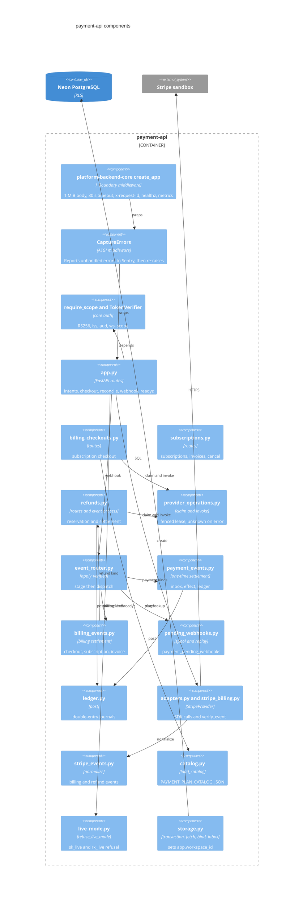

# 07 — C4 Component (payment-api)

```mermaid
C4Component
  title payment-api components
  Container_Boundary(api, "payment-api") {
    Component(core, "platform-backend-core create_app", "_Boundary middleware", "1 MiB body, 30 s timeout, x-request-id, healthz, metrics")
    Component(cap, "CaptureErrors", "ASGI middleware", "Reports unhandled errors to Sentry, then re-raises")
    Component(auth, "require_scope and TokenVerifier", "core auth", "RS256, iss, aud, ws, scope")
    Component(app, "app.py", "FastAPI routes", "intents, checkout, reconcile, webhook, readyz")
    Component(bc, "billing_checkouts.py", "routes", "subscription checkout")
    Component(subs, "subscriptions.py", "routes", "subscriptions, invoices, cancel")
    Component(ref, "refunds.py", "routes and event process", "reservation and settlement")
    Component(ops, "provider_operations.py", "claim and invoke", "fenced lease, unknown on error")
    Component(router, "event_router.py", "apply_verified", "stage then dispatch")
    Component(pe, "payment_events.py", "one-time settlement", "inbox, effect, ledger")
    Component(be, "billing_events.py", "billing settlement", "checkout, subscription, invoice")
    Component(pend, "pending_webhooks.py", "spool and replay", "payment_pending_webhooks")
    Component(led, "ledger.py", "post", "double-entry journals")
    Component(adp, "adapters.py and stripe_billing.py", "StripeProvider", "SDK calls and verify_event")
    Component(sev, "stripe_events.py", "normalize", "billing and refund events")
    Component(cat, "catalog.py", "load_catalog", "PAYMENT_PLAN_CATALOG_JSON")
    Component(live, "live_mode.py", "refuse_live_mode", "sk_live and rk_live refusal")
    Component(st, "storage.py", "transaction, fetch, bind, inbox", "sets app.workspace_id")
  }
  ContainerDb(db, "Neon PostgreSQL", "RLS")
  System_Ext(stripe, "Stripe sandbox", "")
  Rel(core, cap, "wraps")
  Rel(cap, app, "wraps")
  Rel(app, auth, "Depends")
  Rel(app, router, "webhook")
  Rel(app, adp, "create")
  Rel(bc, ops, "claim and invoke")
  Rel(ref, ops, "claim and invoke")
  Rel(bc, cat, "plan lookup")
  Rel(router, pend, "stage")
  Rel(router, pe, "payment kinds")
  Rel(router, be, "billing kinds")
  Rel(be, ref, "refund kind")
  Rel(pe, led, "post")
  Rel(ref, led, "post")
  Rel(adp, sev, "normalize")
  Rel(adp, stripe, "HTTPS")
  Rel(st, db, "SQL")
  Rel(app, live, "startup and readyz")
```

Sources: `src/platform_payment/*.py` (ทุกไฟล์ในภาพ), platform-backend-core `21d5f44` `src/platform_backend_core/http.py`, `auth.py`, `db.py`
